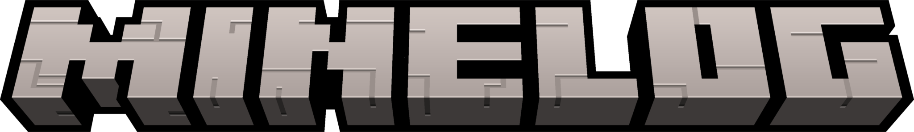
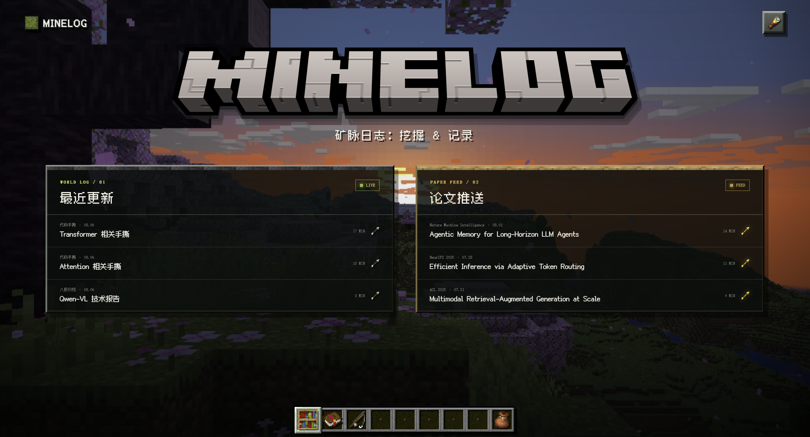
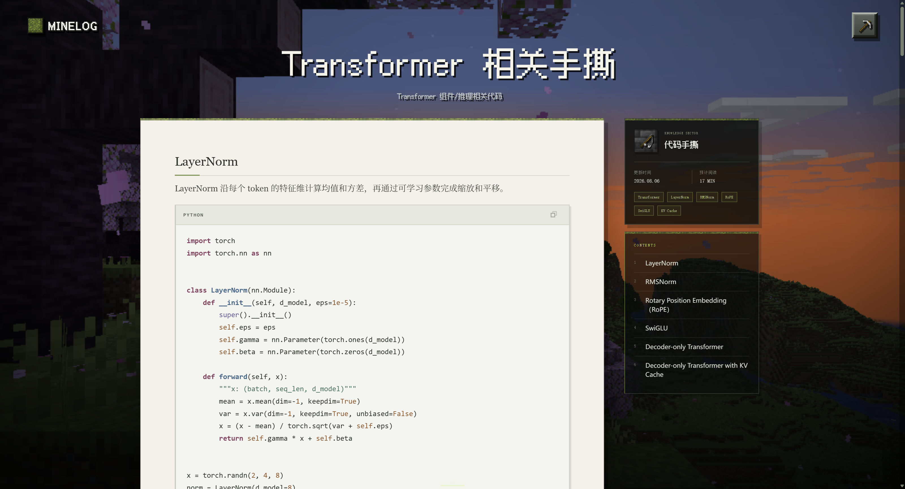
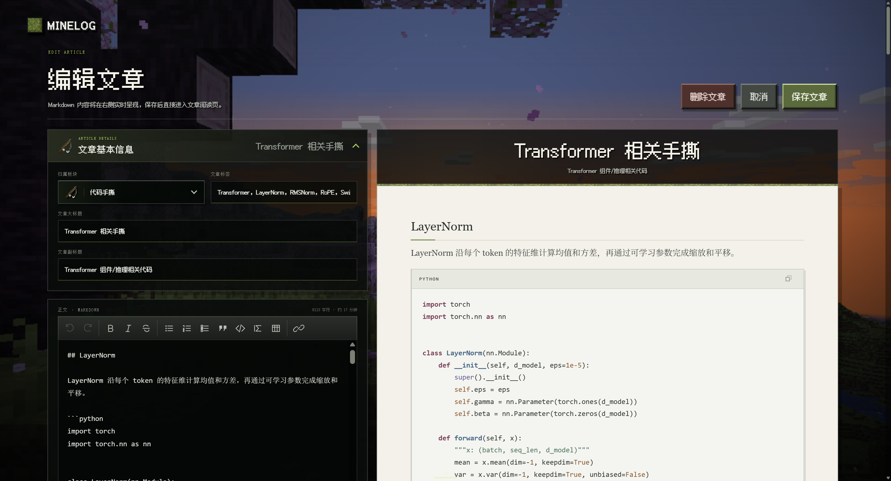

<p align="center">
  
</p>

<h1 align="center">MINELOG</h1>

<p align="center">
  Write knowledge into a world of blocks. A self-hosted personal knowledge base inspired by Minecraft.
</p>

<div align="center">

[](https://nodejs.org/)
[](https://react.dev/)
[](https://www.typescriptlang.org/)
[](./LICENSE)
[](#data-storage)

</div>

<p align="center">
  English | <a href="./docs/README_zh.md">简体中文</a>
</p>

<p align="center">
  <a href="#interface-preview">Interface</a> ·
  <a href="#quick-start">Quick Start</a> ·
  <a href="#deploy-to-vercel">Deployment</a> ·
  <a href="#contributing">Contributing</a>
</p>

<a id="interface-preview"></a>

<table align="center">
  <tr>
    <td align="center">
      <a href="./docs/assets/minelog.png">
        
      </a><br><b>Home</b>
    </td>
    <td align="center">
      <a href="./docs/assets/minelog_article.png">
        
      </a><br><b>Article Reader</b>
    </td>
    <td align="center">
      <a href="./docs/assets/minelog_editor.png">
        
      </a><br><b>Markdown Editor</b>
    </td>
  </tr>
</table>

## About MINELOG

MINELOG is built for technical notes, research reading logs, and long-term knowledge archives. It brings Minecraft-inspired bookshelves, items, and pixel UI into a responsive web application with a complete Markdown writing experience.

The same interface supports both local files and cloud object storage. Use it as a fully offline personal notebook that is easy to back up, or deploy it to Vercel and access the same knowledge base across devices through Cloudflare R2.

## Features

- **An immersive knowledge base** — Organize sections and articles with bookshelves, blocks, hotbar items, and pixel-style motion on desktop and mobile.
- **A complete Markdown workflow** — Write with live preview, a formatting toolbar, GFM tables and task lists, syntax highlighting, math rendering, image uploads, and drag-to-resize images.
- **Flexible organization** — Create custom sections, rearrange hotbar entries, and edit article metadata.
- **Local and cloud modes** — Read and write Markdown files during local development, or use a same-origin Vercel API backed by a private R2 bucket.
- **Protected editing** — Keep reading public while requiring an editor access key for every write operation.

## Quick Start

### Requirements

- Node.js 22.x
- npm

### Install and run

```shell
git clone https://github.com/ChrisDong-THU/MINELOG.git
cd MINELOG
npm install
npm run dev
```

Open the local URL printed in the terminal. Local development requires no Vercel or Cloudflare account and no environment variables.

Build and run a local production version:

```shell
npm run build
npm run start
```

## Data Storage

### Local mode

Running `npm run dev` enables the local file adapter:

```text
content/local/
├─ articles/    # <article UUID>.md
├─ assets/      # Images and attachments keyed by content hash
└─ state/       # Section configuration and initialization state
```

`content/local/` is ignored by Git. To back up or move your knowledge base, stop the development server and copy the entire directory. Restore it to the same location before restarting MINELOG.

### Cloud mode

Production deployments use Vercel for the application and same-origin API, with a private Cloudflare R2 bucket for persistent data:

```text
R2 bucket
├─ state/article-index.json
├─ state/sections.json
├─ articles/<article UUID>.json
└─ assets/<content hash>.<extension>
```

The R2 bucket does not need a public domain or Public Development URL. Every object is accessed by the server through the S3 API.

## Deploy to Vercel

### 1. Create a Cloudflare R2 bucket

Create a private R2 bucket and generate S3 credentials with **Object Read & Write** access scoped only to that bucket. Never commit an access key, secret key, or editor key.

### 2. Configure environment variables

Use [`.env.example`](./.env.example) as the source of required Vercel environment variables.

### 3. Import and deploy

1. Import the repository into Vercel.
2. Select **Other** as the Framework Preset.
3. Select **22.x** as the Node.js version.
4. Add the variables from `.env.example` and deploy.

[`vercel.json`](./vercel.json) configures the production build command as `npm run build:vercel`.

> [!IMPORTANT]
> R2 is the only source of truth for cloud data. Back up the entire bucket with an S3-compatible tool and always preserve `state/`, `articles/`, and `assets/` together.

## Project Structure

| Directory | Description |
| --- | --- |
| [`app/`](./app) | Pages, components, Markdown editor, and reader |
| [`app/api/`](./app/api) | Vercel Route Handler and editor authentication entry point |
| [`build/`](./build) | File-storage plugins used by local development |
| [`server/`](./server) | Server-side Cloudflare R2 S3 adapter |
| [`shared/`](./shared) | Authentication, asset, and security rules shared by both modes |
| [`worker/`](./worker) | Unified content API and Vinext Worker entry point |
| [`tests/`](./tests) | Authentication, storage, rendering, and regression tests |
| [`public/`](./public) | Fonts, block textures, and interface assets |

## Development and Testing

| Command | Description |
| --- | --- |
| `npm run dev` | Start the local-file development server |
| `npm run lint` | Run ESLint |
| `npm run typecheck` | Run the TypeScript type checker |
| `npm run test:unit` | Run the fast unit-test suite |
| `npm test` | Build the project and run all tests |
| `npm run check` | Run lint, type checking, and the complete test suite |
| `npm run build:vercel` | Create the Vercel/Nitro build |

Before opening a pull request, run:

```shell
npm run check
npm run build:vercel
```

## Contributing

Issues and pull requests are welcome. When reporting a problem, please include:

- Your operating system, Node.js version, and runtime mode (local or Vercel + R2)
- The smallest set of steps that reproduces the issue
- Expected and actual behavior
- Relevant screenshots or logs, with all secrets and private content removed

Do not commit `.env.local`, real credentials, or personal knowledge-base data from `content/local/`.

## License and Disclaimer

MINELOG is released under the [GNU General Public License v3.0](./LICENSE). You may use, modify, and distribute this project under the terms of that license.

MINELOG is an independent community project and is not affiliated with Mojang Studios or Microsoft. The Minecraft name, marks, and related assets belong to their respective owners.

## Acknowledgements

- [React](https://react.dev/) and [TypeScript](https://www.typescriptlang.org/)
- [react-markdown](https://github.com/remarkjs/react-markdown), [KaTeX](https://katex.org/), and [highlight.js](https://highlightjs.org/)
- [Vinext](https://github.com/cloudflare/vinext), [Vercel](https://vercel.com/), and [Cloudflare R2](https://developers.cloudflare.com/r2/)

<p align="center">Made with blocks, books and curiosity.</p>
